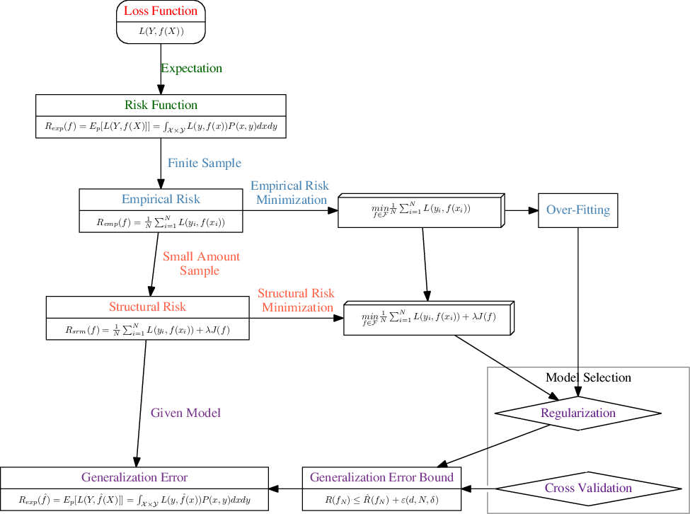

# ladot2eps
#### A simple wrapper of ladot that makes using LaTeX in Dot files relatively easy

This is a simple wrapper of [ladot](http://brighten.bigw.org/projects/ladot/)(which created by [Brighten Godfrey](http://brighten.bigw.org/)), it can generate eps from a dot file with Latex equation.

#### Dependency:
  - latex
  - graphviz
  - ps2eps

Tested on Ubuntu 14.04

#### Usage:
```shell
#!bin/sh
./ladot2eps dotfile.dot
```

#### Example:

The .dot file saved in `./example`
